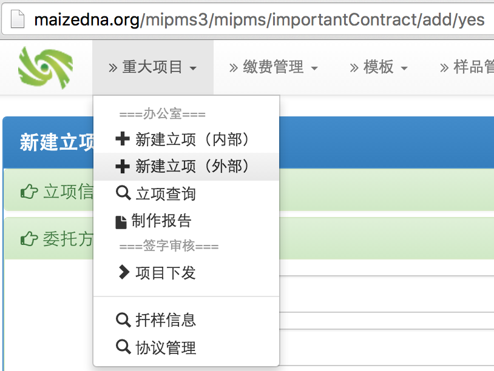

# 第三章 重大项目

## 基本信息
为了避免用户在使用中出现困惑或由于过多的功能而干扰正常的工作流程，系统将一些角色分离出来，使用单独的用户来登录使用。另外，这样也可以让不同的用户来使用一定的功能，而使用同一抽象用户。这样做比较灵活，也使得功能简洁明晰。在需要具体操作用户的名称时，系统还提供输入用户名字的地方，以留存具体的用户信息。

下面是目前使用的登录用户信息：

刘亚维(liuyawei)-->	重大项目办公
宋瑞连(songruilian)-->	委托检验办公
易红梅(	yihongmei)-->	检验结果审核人
葛建镕(gejianrong)-->	项目负责人/检验结果校核人
任洁(renjie)-->		项目负责人/检验结果校核人
审核人(shenhepizhun)-->	委托合同审核人/重大项目立项批准
项目分配(xiangmufenpei)-->	项目分配人
报告批准人(baogaopizhun)-->	报告批准人

## 新建监督抽查项目

使用liuyawei登录系统。从菜单上，选择“重大项目”，“新建立项（外部）”，界面示意如下：

然后输入以下信息：

 委托方单位信息示例： 
 
 
 单位名称：全国农业技术推广服务中心种子质量监督检验处
 联系人： 张力学
 联系电话： 010-5919195
 通讯地址：北京朝阳区麦子店街20号楼
 
 
 检验信息处，信息示例如下：
 
 
 
 项目名称：2016年农业部企业监督抽查样品真实性检测
 检验内容：与数据库比较，筛查同名和疑似品种。
 检验依据：真实性：NY/T1432-2014玉米品种鉴定技术规程SSR分子标记法
 检验方法：SSR标记
 
 
 
 这步可以关联协议，可以上传相关附件。之后，可以保存草稿。最终，当信息填写完整后，就可以生成立项了。
 
 
 生成立项后，需要进行立项批准。
 
 
 
 