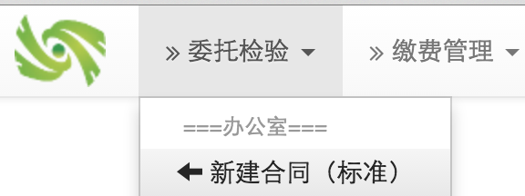
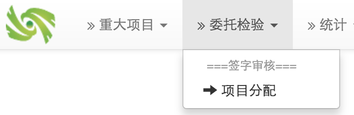

# 第二章： 快速上手

## 2.1 准备用户
使用projectadmin登录，建立如下用户：
### 2.1.1 办公室
* liuyawei/重大项目办公人员，角色为：重大项目办公
* songruilian/委托检验办公人员，角色为：委托检验办公

### 2.1.2 检验室
* gejianrong/项目负责人员，角色为：项目负责人，检验结果审核人
* renjie/项目负责人员，角色为：项目负责人，检验结果审核人
* wanglu/检验员，角色为：检验员
* wangrui/检验员，角色为：检验员
* houzhenhua/检验员，角色为：检验员

### 2.1.3 批准审核
* xiangmufenpei/办公室办公人员，角色为：项目分配人
* shenhepizhun/合同审核，角色为：合同审核人，重大项目立项批准，报告审核人

## 2.2 委托检验基本工作流程
### 2.2.1 新建标准委托检验合同

我们先做一个对外检测的真实性比对任务。
我们假设宋瑞莲是办公室负责委托检验的人员，则使用她的帐户：songruilian登录系统；

之后，执行“新建标准合同”操作；

收集真正的信息（对敏感信息做一些变更)...

输入“ 委托单位信息”信息，“检验信息”，以及“样品信息”，就可以“提交审核”了。
如果有的必填字段遗漏，系统会给出提示。

下面是一个填写示例：

下面是检验信息：

然后，手工录入样品信息，或者从Excel导入样品信息，再计算一下检测费用，就可以保存了。点“提交审核”进行保存。

### 2.2.2 审核新合同

使用shenhepizhun登录，在“委托检验”-〉“合同批准”处，查到相应的合同 - 这个有新合同标示。

查出合同后，在相应行的最右边，有操作选项；进去后，操作非常简单，根据内容，只有两个选择：

我们选择“批准通过”。

### 2.2.3 合同打印
使用如下菜单查询到合同后，即可以使用相应行右侧的操作图标，进行打印。

打印的合同示例如下：

### 2.2.4 项目下发

还使用songruilian登录系统，使用如下菜单项：

的最后一个“项目下发”，找到刚才的项目，执行相应行最右侧的“操作”图标。在新的窗口中，填写“下发说明”部份信息，然后点“项目下发”按钮。

### 2.2.5 项目分配

使用xiangmufenpei用户登录系统，按下图所示，找到需要分配的项目：

选择相应的项目操作后，会出现下面的界面：

选择“项目负责人”后，填写相应的备注信息（如果有的话），然后点“分配”按钮，以完成分配工作。

### 2.2.6 实验任务下发
以项目负责人的身份登录：这里以renjie登录。登录后在“我负责的项目”中，可以看到被分配的项目。这时，可以对这个项目进行实验设计的操作。虽然这个操作在环节中目前看不是必须的，但是这步对于检验结果的审核是必须的。

在设计完实验后，即可以做“组织实验“的操作，以挑选样品，为分配任务做准备。
这个界面主要是生成样品列表，以备下一步生成并分配实验任务。

这个的结果会导出样品列表：列表中，每个样品行，必须有一个项目号对应。此处的指导原因是松耦合，以避免对实验产生干扰。主要以记录关键信息为目的。

### 2.2.7 实验结果反馈

### 2.2.8 检验报告反馈

### 2.2.9 检验报告审核

### 2.2.10 检验报告下发

